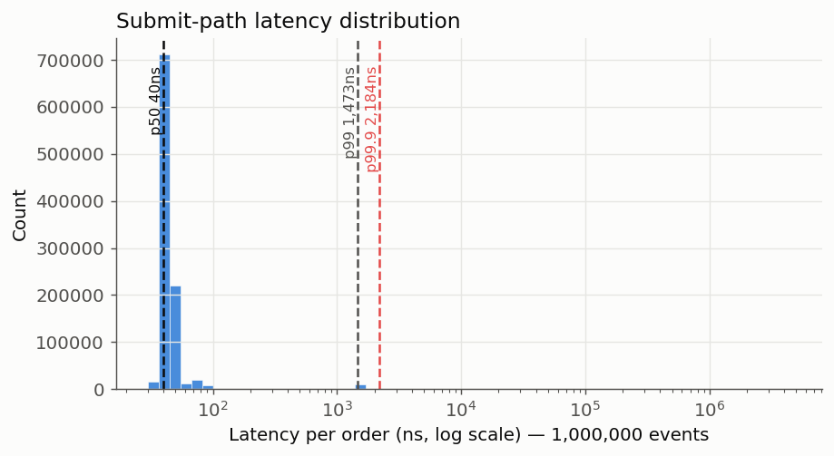
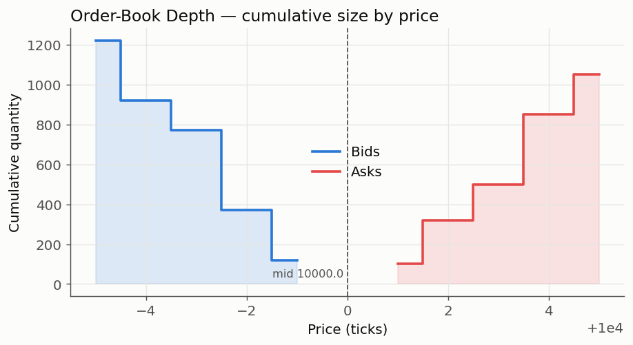
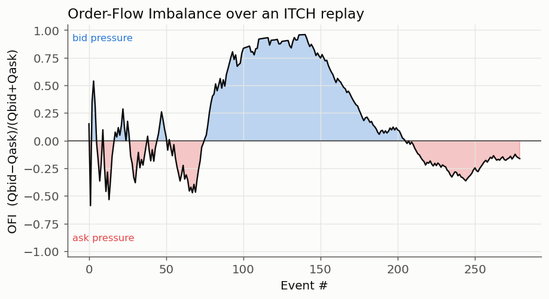

# LOB Matching Engine

A low-latency **limit order book matching engine** in C++20, with NASDAQ
TotalView-ITCH 5.0 feed parsing, a lock-free SPSC ingest pipeline, object-pool
allocation on the hot path, microstructure signals, and Python bindings.

Built for correctness first (price-time priority, sanitizer-clean, CI-gated) and
speed second (sub-microsecond median submit latency).

[](../../actions)

---

## Architecture

```
                 ┌───────────────┐   lock-free    ┌──────────────────────────┐
   ITCH 5.0 /    │   ingest      │  SPSC ring     │      matching thread      │
   order flow ──▶│   thread      │ ─────────────▶ │  (single owner, no locks) │
                 │ (parse/decode)│  acquire/      │                           │
                 └───────────────┘  release       │   RiskGuard  ─▶  reject   │
                                                   │       │                   │
                                                   │       ▼                   │
                                                   │   OrderBook               │
                                                   │   ├ bids: map<Price,…,>>  │
                                                   │   ├ asks: map<Price,…>    │
                                                   │   ├ Level: list<Order>    │  ─▶ trades
                                                   │   └ index: id → iterator  │
                                                   └──────────────────────────┘
```

The matcher is **single-threaded on purpose** — price-time priority is a total
ordering, so one owning thread gives determinism, perfect cache locality, and
zero synchronization cost. Concurrency lives *only* at the boundary: a wait-free
SPSC ring hands orders from the ingest thread to the matcher.

---

## Performance

Submit path (`order in → trades vector out`), 1,000,000 events, after the
object-pool optimization. Full methodology and baseline in [BENCHMARKS.md](BENCHMARKS.md).

| Percentile | Latency |
|-----------:|:--------|
| p50        | ~100 ns |
| p95        | 100–400 ns |
| p99        | 200–900 ns |
| p99.9      | ~6 µs (≈3–4× tighter tail vs. system allocator) |

Microbenchmarks (Google Benchmark, median of 3): resting insert ~122 ns
(−38% vs. baseline), cancel ~100 ns (−37%).



---

## Key Design Decisions

| Decision | Why |
|---|---|
| **Integer tick pricing** (`Price = int64_t`) | Floating point can't represent most decimals exactly (`0.1 + 0.2 ≠ 0.3`) — that silently breaks price comparison and matching. Signed so spreads/PnL can go negative. |
| **Single-threaded matcher** | Price-time priority is sequential by definition; one owner ⇒ determinism, cache locality, no locks. |
| **Price-time priority (FIFO)** | The dominant exchange rule; queue position is a real, optimizable asset. `std::list` per level gives O(1) erase-by-iterator for cancels. |
| **Object pool on the hot path** | `new`/`delete` can lock, scatter memory, and stall in the tail. A per-arena free-list keeps resting/cancel allocation-free once warm — this is what tightened p99.9. |
| **Acquire/release SPSC** | Correct cross-thread publication without the full barrier of `seq_cst`; the release-store / acquire-load handshake guarantees the consumer sees the producer's buffer write. |
| **Inline risk guard** | Every order is size/notional/position checked *before* it can rest or trade — mirrors a real pre-trade risk gate. |

---

## Order Book Depth

Reconstructed L2 view — cumulative size by price on each side of the touch.



---

## Microstructure Signals

Computed directly from a real **L3 book reconstruction** off the ITCH feed:

- **Microprice** — mid, but weighted by *opposite-side* depth (leans toward the
  thin side, where price is more likely to move):
  ```
  microprice = P_bid · Q_ask/(Q_bid+Q_ask) + P_ask · Q_bid/(Q_bid+Q_ask)
  ```
- **Order-Flow Imbalance** — `(Q_bid − Q_ask) / (Q_bid + Q_ask) ∈ [−1, 1]`;
  a leading indicator of short-horizon price moves.



---

## Scenarios Validated

`./build/scenarios` asserts each end-to-end outcome:

| Scenario | Meaning | Status |
|---|---|:--:|
| `NO_SIGNAL`     | order rests, no cross | ✅ |
| `BUY_FILL`      | crossing buy fills against the ask | ✅ |
| `SELL_FILL`     | crossing sell fills against the bid | ✅ |
| `RISK_REJECT`   | order exceeds a risk limit | ✅ |
| `INVALID_ORDER` | zero quantity / zero price | ✅ |

Plus 11 Catch2 unit tests, run under ASan+UBSan in CI. The SPSC pipeline is
verified deterministic vs. single-threaded and run under **ThreadSanitizer**.

---

## Build & Run

Requires CMake ≥ 3.20 and a C++20 compiler.

```bash
cmake -B build -DCMAKE_BUILD_TYPE=Release
cmake --build build -j

./build/demo            # matching demo
./build/scenarios       # scenario validation suite
ctest --test-dir build  # unit tests
./build/pipeline        # concurrent ingest→match, determinism check
./build/itch_replay      # synthetic ITCH replay + signals
./build/itch_replay data/your_feed.itch   # replay a real ITCH 5.0 file
./build/bench           # latency percentiles + Google Benchmark
```

### Python bindings

```bash
cmake --build build --target lobpy -j
PYTHONPATH=build python3 -c "import lobpy; b=lobpy.OrderBook(); print('ok')"
PYTHONPATH=build python3 python/make_charts.py   # regenerate README charts
```

```python
import lobpy as L
book = L.OrderBook()
book.submit(L.Order(1, L.Side.Sell, L.OrderType.Limit, 10_100, 50))
res = book.submit(L.Order(2, L.Side.Buy, L.OrderType.Limit, 10_100, 30))
print(res.trades[0], res.risk)
```

The notebook [`notebooks/visualize.ipynb`](notebooks/visualize.ipynb) reproduces
all three charts interactively.

---

## Project Layout

```
include/lob/   types · order_book · risk · pool · spsc_ring · itch_parser
src/           order_book.cpp · itch_parser.cpp · main.cpp
apps/          pipeline.cpp (SPSC) · itch_replay.cpp (ITCH)
tests/         Catch2 unit tests          scenarios/  5-outcome validation
bench/         latency + throughput       python/     lobpy bindings, chart gen
```

---

## Future Work

- **DPDK Ring PMD virtual path** for kernel-bypass packet processing
  (RX → decode → book → strategy → risk → TX), targeting sub-200 ns p50
  application-side latency on the full hot path.
- **Array-indexed price levels** for a dense band around the touch: O(1),
  cache-line-friendly best-price lookup (see BENCHMARKS.md, "Considered next").
- **Event-driven microstructure backtester** (Project 2) built on this engine as
  the fill simulator: queue-position-aware fills, two-sided latency modeling,
  Avellaneda-Stoikov market making, PnL attribution, walk-forward validation.

---

## Interview Talking Points

- Integer-tick pricing and why floats are wrong for money.
- The price-time priority matching loop (whiteboard-ready in `match_side`).
- Microprice, order-flow imbalance, adverse selection, queue position.
- Cache locality: tree vs. array levels, with measured numbers.
- Object pool: eliminating hot-path allocation and what it did to the tail.
- SPSC acquire/release ordering and why the matcher stays single-threaded.
- ITCH 5.0 message types and faithful book reconstruction from real market data.
```
